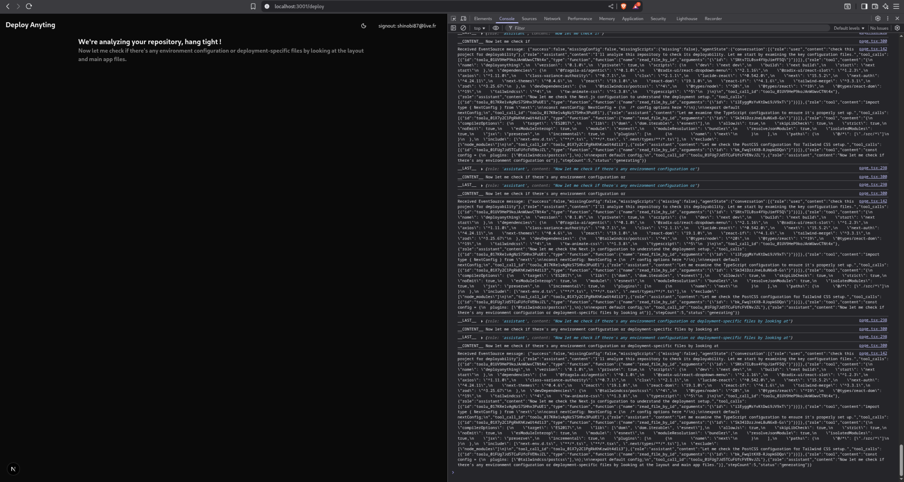

# Deploy Anything 🚀

*Created on September 7, 2025*

A powerful Next.js application that leverages AI agents to analyze GitHub repositories and streamline the deployment process. Built with modern web technologies and AI-powered repository diagnostics.

## 📸 Project Preview

<!-- Image placeholder - Add project screenshot here -->

*Hackathon Agent Building*

## 👥 Authors

This project was developed by:

- **Etienne Desaintjean** - Developer
- **Eclipse Touret** - Developer
- **Arnaud Durand** - Developer
- **Yulin Zhuang** - Developer

## ✨ Features

- **AI-Powered Repository Analysis**: Automatically analyzes GitHub repositories to identify missing configurations and deployment requirements
- **GitHub Integration**: Seamless authentication and repository access through GitHub OAuth
- **Real-time Diagnostics**: Live streaming of repository analysis results
- **Modern UI**: Clean, responsive interface with dark/light theme support
- **TypeScript Support**: Fully typed codebase for better development experience
- **Tailwind CSS**: Modern styling with utility-first CSS framework

## 🛠️ Tech Stack

- **Framework**: [Next.js 15.5.2](https://nextjs.org/) with React 19
- **Language**: TypeScript
- **Styling**: [Tailwind CSS 4](https://tailwindcss.com/)
- **UI Components**: [Radix UI](https://www.radix-ui.com/) primitives
- **Authentication**: [NextAuth.js](https://next-auth.js.org/) with GitHub provider
- **AI Framework**: [Fragola AI Agentic](https://www.npmjs.com/package/@fragola-ai/agentic)
- **Icons**: [Lucide React](https://lucide.dev/)
- **HTTP Client**: [Axios](https://axios-http.com/)
- **Validation**: [Zod](https://zod.dev/)

## Technology Stack

- [Next.js](https://nextjs.org/) for the amazing React framework
- [Fragola AI](https://www.npmjs.com/package/@fragola-ai/agentic) for the AI agent framework
- [Tailwind CSS](https://tailwindcss.com/) for the utility-first CSS framework
- [Radix UI](https://www.radix-ui.com/) for accessible UI primitives
- [Shadcn/ui](https://ui.shadcn.com/) for the beautiful component library

## 🚀 Getting Started

### Prerequisites

- Node.js 18+ 
- npm, yarn, or bun package manager
- GitHub OAuth App credentials

### Installation

1. **Clone the repository**
   ```bash
   git clone https://github.com/shadokan87/Deploy-Anything.git
   cd Deploy-Anything
   ```

2. **Install dependencies**
   ```bash
   npm install
   # or
   yarn install
   # or
   bun install
   ```

3. **Set up environment variables**
   
   Create a `.env.local` file in the root directory:
   ```env
   NEXTAUTH_URL=http://localhost:3000
   NEXTAUTH_SECRET=your-nextauth-secret
   GITHUB_CLIENT_ID=your-github-client-id
   GITHUB_CLIENT_SECRET=your-github-client-secret
   ```

4. **Run the development server**
   ```bash
   npm run dev
   # or
   yarn dev
   # or
   bun dev
   ```

5. **Open your browser**
   
   Navigate to [http://localhost:3000](http://localhost:3000) to see the application.

## 🔧 Configuration

### GitHub OAuth Setup

1. Go to [GitHub Developer Settings](https://github.com/settings/developers)
2. Create a new OAuth App with:
   - **Application name**: Deploy Anything
   - **Homepage URL**: `http://localhost:3000`
   - **Authorization callback URL**: `http://localhost:3000/api/auth/callback/github`
3. Copy the Client ID and Client Secret to your `.env.local` file

### AI Agent Configuration

The application uses Fragola AI agents for repository analysis. Configure your AI model settings in `src/agents/readRepo/readRepo.agent.ts`.

## 📖 Usage

1. **Authentication**: Sign in with your GitHub account
2. **Repository Analysis**: Enter a GitHub repository URL (e.g., `https://github.com/username/repository`)
3. **AI Diagnostics**: The AI agent will analyze the repository for:
   - Missing configuration files
   - Missing build/deployment scripts
   - Deployment readiness assessment
4. **Real-time Updates**: Watch as the analysis progresses with live updates

## 🏗️ Project Structure

```
src/
├── app/                    # Next.js App Router
│   ├── api/               # API routes
│   ├── components/        # Page-specific components
│   ├── deploy/           # Deployment page
│   ├── github/           # GitHub OAuth callback
│   └── prompts/          # AI prompts
├── agents/               # AI agents
│   └── readRepo/         # Repository analysis agent
├── components/           # Reusable UI components
│   └── ui/              # Shadcn/ui components
├── lib/                 # Utility functions
└── types/               # TypeScript type definitions
```

## 🎨 UI Components

This project uses a modern component system built on:

- **Radix UI**: Accessible, unstyled UI primitives
- **Tailwind CSS**: Utility-first CSS framework
- **Shadcn/ui**: Pre-built component library
- **Lucide React**: Beautiful, customizable icons

## 🔒 Authentication

Authentication is handled by NextAuth.js with GitHub as the OAuth provider. The application requires GitHub authentication to:

- Access repository information
- Perform repository analysis
- Maintain user sessions

## 🤖 AI Agents

The application leverages Fragola AI's agentic framework to create intelligent agents that can:

- Read and analyze repository files
- Identify missing configurations
- Provide deployment recommendations
- Stream real-time analysis results

## 🚀 Deployment

### Vercel (Recommended)

1. Push your code to GitHub
2. Connect your repository to [Vercel](https://vercel.com)
3. Add your environment variables in the Vercel dashboard
4. Deploy automatically on every push

### Other Platforms

The application can be deployed on any platform that supports Next.js:

- **Netlify**: Use the `next build` command
- **Railway**: Automatic deployment from GitHub
- **Docker**: Create a Dockerfile for containerized deployment

## 🤝 Contributing

Contributions are welcome! Please feel free to submit a Pull Request. For major changes, please open an issue first to discuss what you would like to change.

### Development Guidelines

1. Follow the existing code style and conventions
2. Write TypeScript with proper type definitions
3. Use Tailwind CSS for styling
4. Test your changes thoroughly
5. Update documentation as needed

## 📝 License

This project is private and proprietary. All rights reserved.

## 🐛 Issues & Support

If you encounter any issues or need support:

1. Check the [Issues](https://github.com/shadokan87/Deploy-Anything/issues) page
2. Create a new issue with detailed information
3. Include steps to reproduce the problem

## 🙏 Acknowledgments

### Special Thanks

We extend our heartfelt gratitude to:

- **[42 AI Association](https://42ai.fr/)** - For organizing this incredible hackathon and fostering innovation in AI
- **[Blackbox.ai](https://www.blackbox.ai/)** - For sponsoring the event and providing cutting-edge AI tools and resources

### Hackathon

This project was developed during the hackathon organized by **42 AI Association** in partnership with **Blackbox.ai**. We're grateful for the opportunity to participate in this innovative event that brings together developers, AI enthusiasts, and industry leaders.

---

**Deploy Anything** - Streamlining deployment with AI-powered repository analysis 🚀
